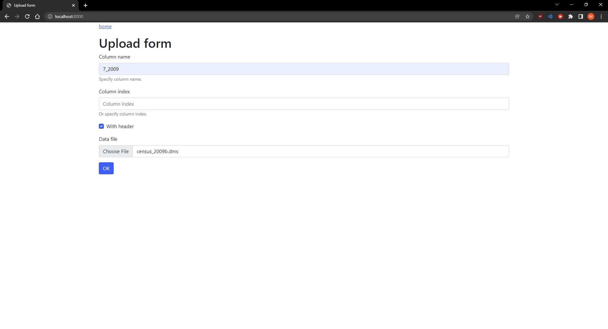
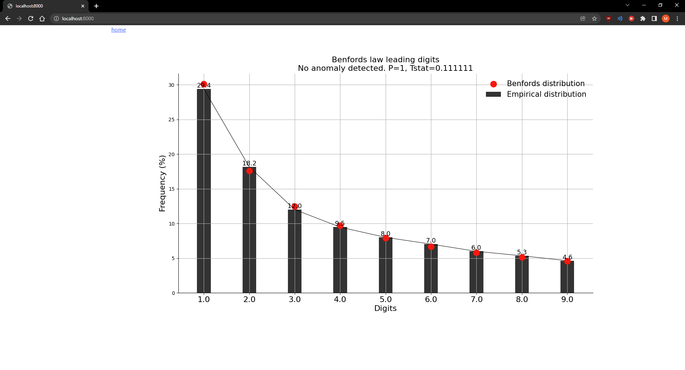

### Building and running

In docker:
```shell
$ docker-compose build
$ docker-compose run
```

Locally:
```shell
$ pipenv shell && pipenv sync && pipenv sync --dev
```

### Tests

As simple as running:
```shell
$ python manage.py test -v 3
```

### Using

Supported files are generally variations of `csv` formats. Dialect of said csv file is determined
using built-in csv sniffer.

#### Fields:
* Column name - specify the exact name of the column
* Column index - or specify exact index of the column (starting from 0 obviously.)
* With Header - whether file has HEADER row at the top
* Choose file 
* Ok!



* Benford's law!

